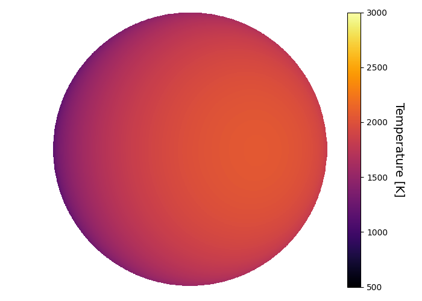
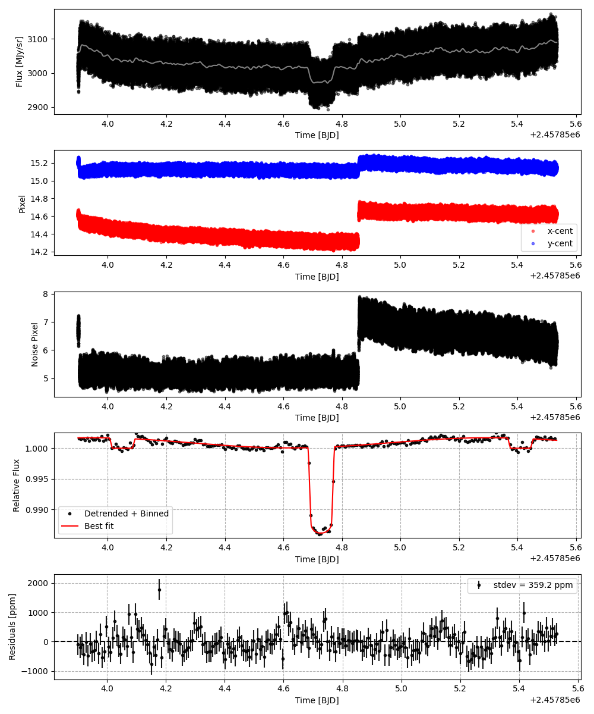
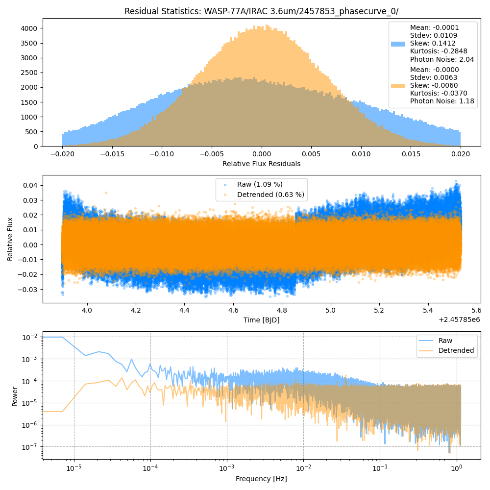
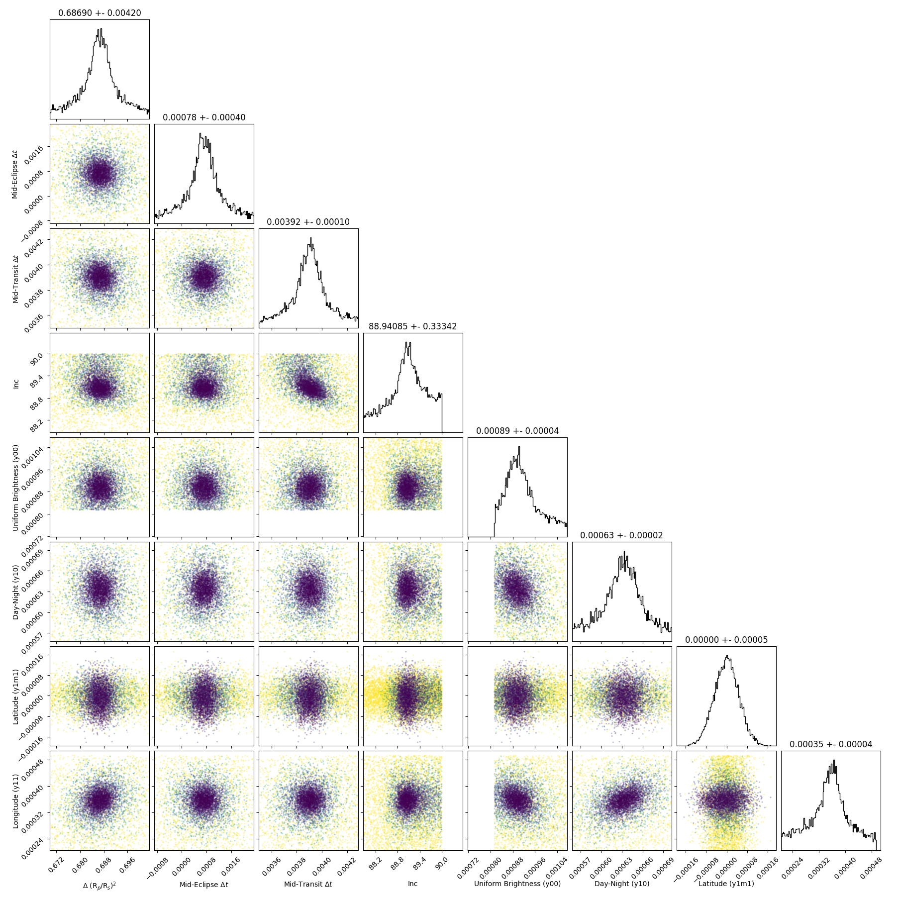
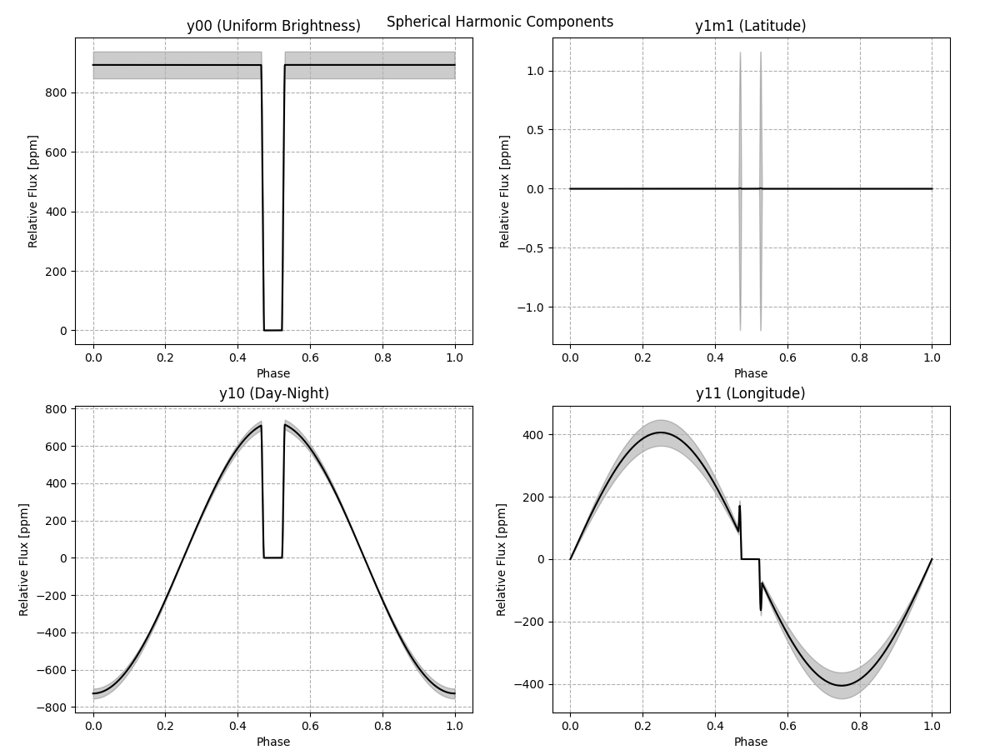
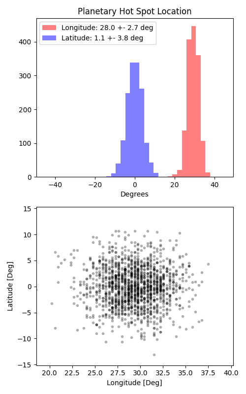

```
# target: wasp-77a
# filter: IRAC 3.6um
# tmid: 2457854.727903 +- 0.000099
# emid: 2457854.049351 +- 0.000403
# transit_depth: 0.014288+-0.000021
# eclipse_depth: 0.001723 +- 0.000056
# nightside_amp: 0.000400 +- 0.000070
# hotspot_amp: 0.001725 +- 0.000056
# hotspot_lon[deg]: 29.384164 +- 2.714288
# hotspot_lat[deg]: 0.087977 +- 3.811404
time,flux,err,xcent,ycent,npp,phase,raw_flux,phasecurve
2457853.898409,0.995389,0.005359,14.600832,15.208994,6.494701,0.386553,3005.524303,1.001708
2457853.898413,1.009185,0.005325,14.614974,15.192977,6.508035,0.386556,3043.871736,1.001708
2457853.898418,1.007923,0.005324,14.596770,15.185427,6.536743,0.386560,3044.876555,1.001708
2457853.898423,1.002375,0.005347,14.600748,15.202775,6.675776,0.386563,3018.622991,1.001708
2457853.898427,1.005139,0.005345,14.602426,15.217484,6.683483,0.386567,3021.304860,1.001708

...
```

[timeseries.csv](timeseries.csv)

```python
import pandas as pd

df = pd.read_csv('timeseries.csv', comment='#')

# extract comments from the file
with open('timeseries.csv', 'r') as f:
    comments = [line for line in f if line.startswith('#')]

# clean and convert to a dictionary
comments_dict = dict()
for comment in comments:
    key, value = comment[1:].strip().split(': ')
    comments_dict[key] = value

# print the comments
print(comments_dict)
```















