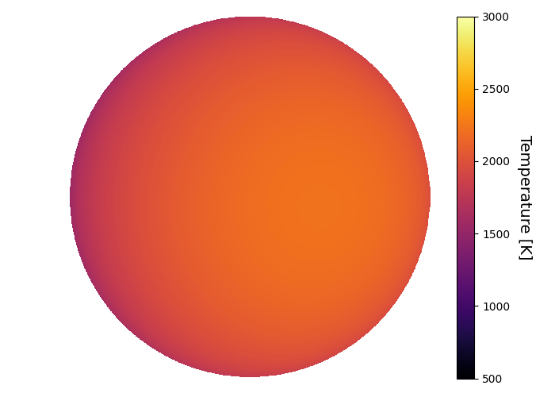
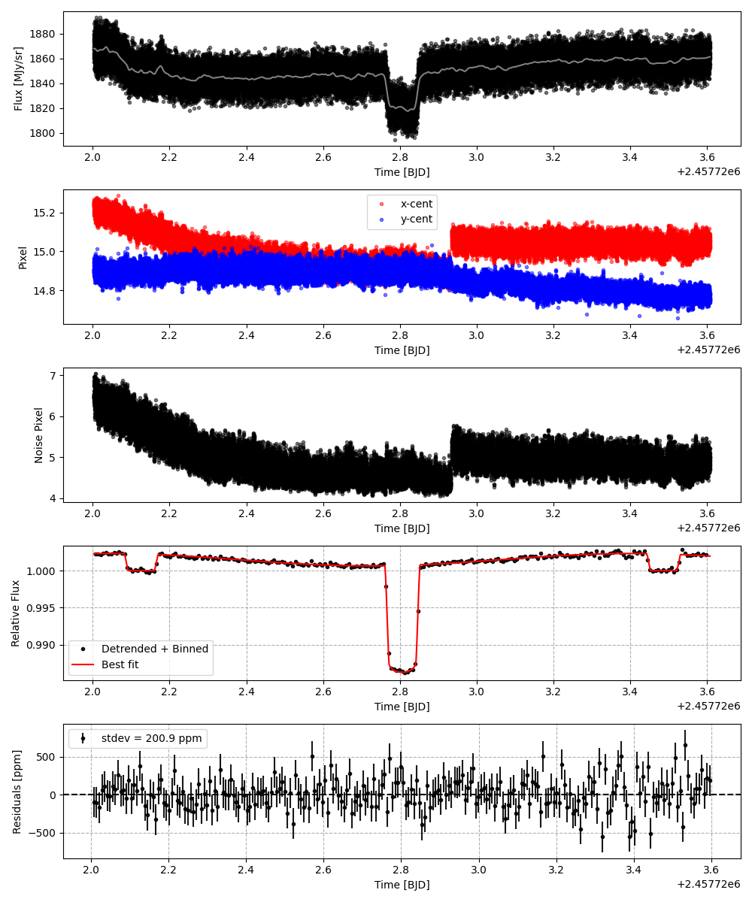
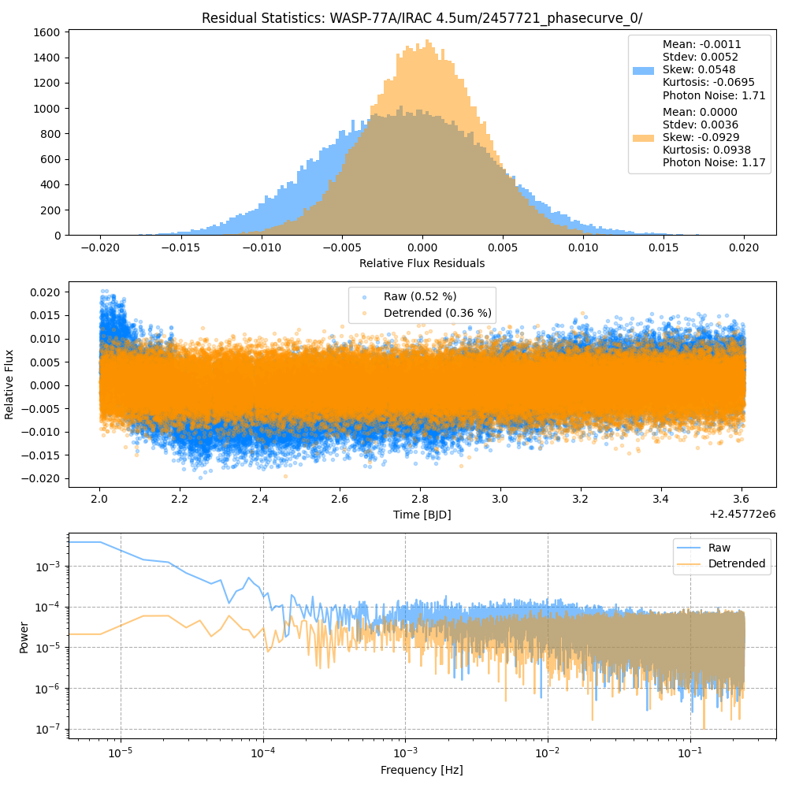
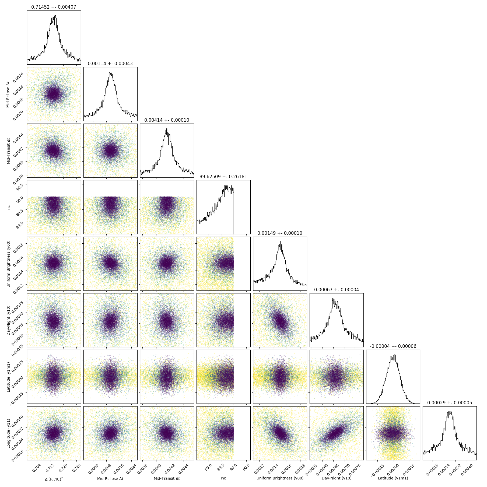
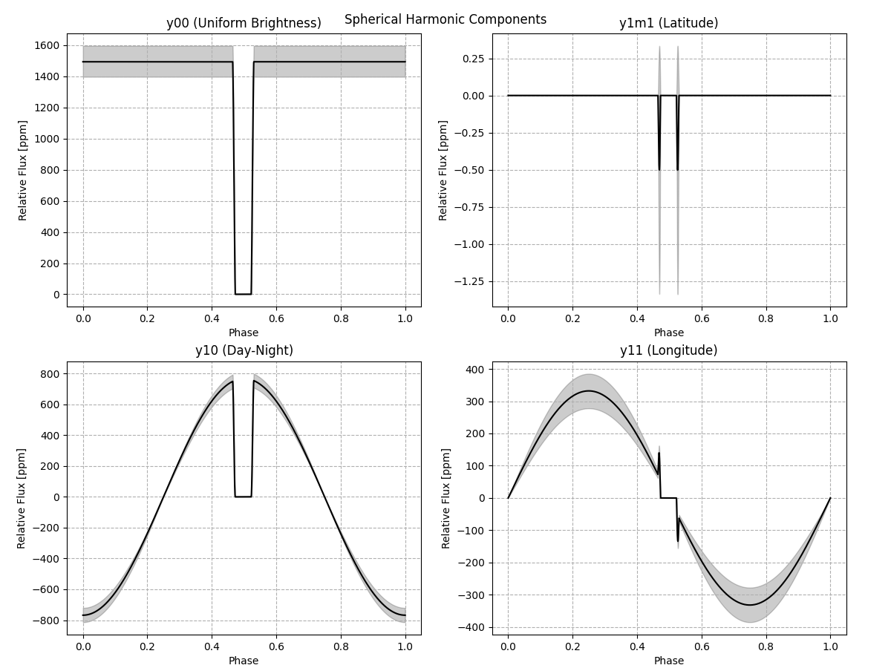
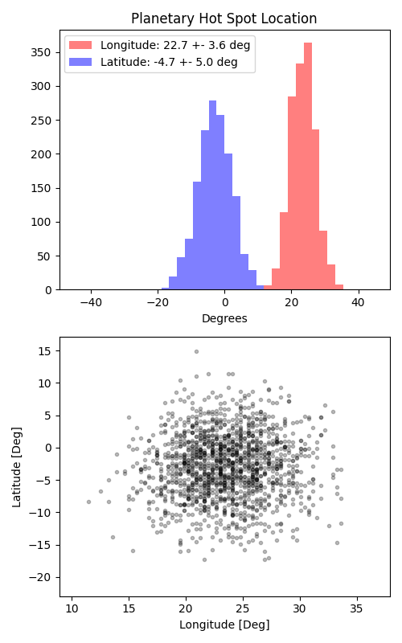

```
# target: wasp-77a
# filter: IRAC 4.5um
# tmid: 2457722.804870 +- 0.000099
# emid: 2457722.126212 +- 0.000426
# transit_depth: 0.014674+-0.000039
# eclipse_depth: 0.002330 +- 0.000109
# nightside_amp: 0.000935 +- 0.000146
# hotspot_amp: 0.002330 +- 0.000109
# hotspot_lon[deg]: 23.401760 +- 3.631959
# hotspot_lat[deg]: -2.903226 +- 5.016006
time,flux,err,xcent,ycent,npp,phase,raw_flux,phasecurve
2457722.003222,1.002958,0.003260,15.257428,14.945867,6.870299,0.407102,1864.334796,1.002318
2457722.003245,1.000684,0.003264,15.242898,14.948788,6.801492,0.407118,1860.643611,1.002318
2457722.003268,0.998821,0.003264,15.244986,14.937333,6.749952,0.407135,1859.612931,1.002318
2457722.003291,1.002123,0.003261,15.250488,14.945132,6.836433,0.407152,1863.198184,1.002318
2457722.003314,1.007618,0.003251,15.258934,14.939237,6.771734,0.407169,1874.524192,1.002318

...
```

[timeseries.csv](timeseries.csv)

```python
import pandas as pd

df = pd.read_csv('timeseries.csv', comment='#')

# extract comments from the file
with open('timeseries.csv', 'r') as f:
    comments = [line for line in f if line.startswith('#')]

# clean and convert to a dictionary
comments_dict = dict()
for comment in comments:
    key, value = comment[1:].strip().split(': ')
    comments_dict[key] = value

# print the comments
print(comments_dict)
```















