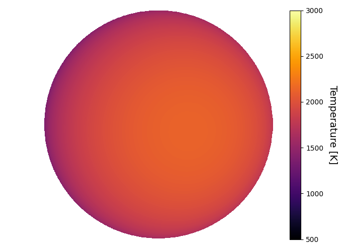

```
# target: wasp-95
# filter: IRAC 4.5um
# tmid: 2458534.045633 +- 0.000135
# emid: 2458532.954731 +- 0.000694
# transit_depth: 0.010894+-0.000028
# eclipse_depth: 0.001576 +- 0.000071
# nightside_amp: 0.000123 +- 0.000090
# hotspot_amp: 0.001576 +- 0.000071
# hotspot_lon[deg]: 15.659824 +- 2.582242
# hotspot_lat[deg]: -3.431085 +- 2.422423
time,flux,err,xcent,ycent,npp,phase,raw_flux,phasecurve
2458532.806669,1.000285,0.003431,14.303189,15.287260,5.289256,0.432224,1683.729363,1.001566
2458532.806692,1.001529,0.003429,14.300632,15.281437,5.210533,0.432234,1685.070693,1.001566
2458532.806714,0.999944,0.003432,14.278657,15.300294,5.300594,0.432245,1682.083631,1.001566
2458532.806737,0.998891,0.003432,14.297934,15.307672,5.365768,0.432255,1682.269104,1.001566
2458532.806845,1.007467,0.003419,14.301685,15.305373,5.351870,0.432305,1694.935439,1.001566

...
```

[timeseries.csv](timeseries.csv)

```python
import pandas as pd

df = pd.read_csv('timeseries.csv', comment='#')

# extract comments from the file
with open('timeseries.csv', 'r') as f:
    comments = [line for line in f if line.startswith('#')]

# clean and convert to a dictionary
comments_dict = dict()
for comment in comments:
    key, value = comment[1:].strip().split(': ')
    comments_dict[key] = value

# print the comments
print(comments_dict)
```





