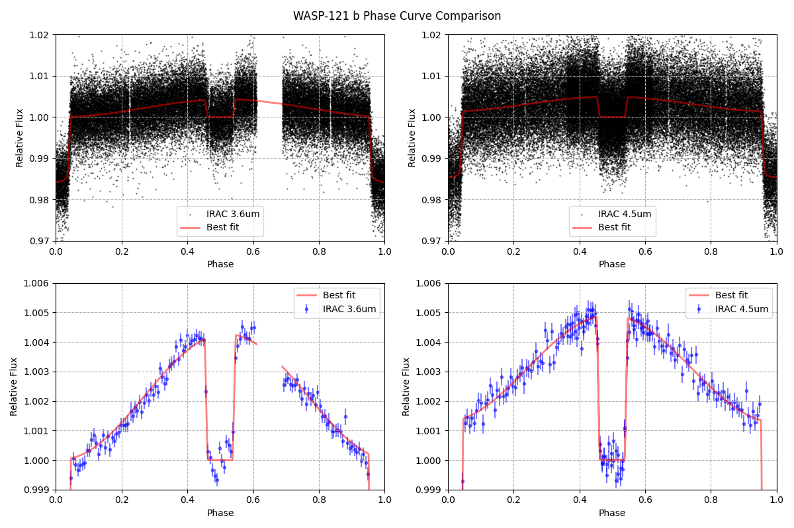

# Spitzer-Exoplanet-Analysis

An analysis of all publicly available images from the Spitzer Space Telescope pertaining to transiting exoplanets observed with the Infrared Array Camera (IRAC). This pipeline supports processing all 4 IRAC Channels (3.6, 4.5, 5.8, 8.0 um) and data acquired in sub-frame and full-frame mode. The NASA Exoplanet Archive and Spitzer Heritage Archive are used to dynamically populate a target list based on available data and used to acquire transit priors. Transits, eclipses and phase curves are modelled using the analytic expressions of starry. Gaussian kernel regression is used to correct for intrapixel flux variations as a result motions onboard the spacecraft. 

For more information on the analysis: https://www.overleaf.com/read/fcfkxyggqjys#1b33db





## Example Run
```
python query_spitzer.py -t "WASP-1"
python query_priors.py -t "WASP-121"
python photometry.py -t WASP-121
python fit_map.py -t WASP-121
```

## Pixel Map
Gaussian kernel regression is used to estimate the intrapixel gain variations where subpixel motions onboard the space craft cause the flux to change. GKR is a fancy way of approximating a non-linear function by averaging data in a manner that's similar to a sliding boxcar/ gaussian weighted average. However, as opposed to averaging data points in time, the data points nearest centroid positions are averaged to approximate the relative change in flux as a function of position. The relative change in flux can be plotted as a function of centroid position to create something like a flat field:


Gaussian kernel regression is accomplished for N dimensions using the algorithm below  
```python
import numpy as np
from scipy.spatial import cKDTree

weightedflux = lambda flux, gw, nearest: np.sum(flux[nearest]*gw,axis=-1)

def gaussian_weights( X, w=None, neighbors=100, feature_scale=1000):
    if isinstance(w, type(None)): w = np.ones(X.shape[1])
    Xm = (X - np.median(X,0))
    kdtree  = cKDTree(Xm*feature_scale)
    nearest = np.zeros((X.shape[0],neighbors))
    gw  = np.zeros((X.shape[0],neighbors),dtype=np.float64)
    for point in range(X.shape[0]):
        ind = kdtree.query(kdtree.data[point],neighbors+1)[1][1:]
        dX  = Xm[ind] - Xm[point]
        Xstd= np.std(dX,0)       
        gX = np.exp(- w * dX**2/(2*Xstd**2))
        gwX  = np.product(gX,1)
        gw[point,:] = gwX/gwX.sum()
        nearest[point,:] = ind
    return gw, nearest.astype(int)
```

## 3D Brightness Model

The 3D brightness model describes the flux integrated over the surface of an exoplanet as a function of time and orbital phase. The model is described in detail in the starry documentation. The model is used to fit the observed flux as a function of time and orbital phase. The brightness variations across the surface of an Exoplanet can be modelled with as a linear system of spherical harmonics.

### Eclipses


Basis vectors of varying degree and order are used to model the brightness variations across the surface of an exoplanet. The basis vectors are weighted by the coefficients of the spherical harmonic expansion. The coefficients can be fit to the observed flux using linear least squares method (matrix inversion) or with a Monte Carlo technique (e.g. nested sampling or Markov chain).


The respecitve 2D projection for each of the spherical harmonics shown above.


### Phasecurves


A comparison of the basis vectors used to make the phase curve function (except for the transit vector) and how they correspond to brightness variations across the day-side of a planet. The basis vectors are integrated over the course of one orbit and use a planet with 0 obliquity and synchronous rotation. A consequence of spherical harmonic modeling may yield non-physical solutions therefore it is important to construct conditional priors in order to ensure positive intensity values over the planet's ``surface''. The planet images were taken at a phase of 0.5.

## Pipeline Steps

1. Get a list of transiting explanets from the NASA Exoplanet Archive and then query the Spitzer Archive API. `query_spitzer.py` creates a directory for each star and saves a pickle file containing a list of URLs for each image. Run for a single target or for all

```
usage: query_spitzer.py [-h] [-t TARGET] [-d DATADIR]

optional arguments:
  -h, --help            show this help message and exit
  -t TARGET, --target TARGET
                        Choose a target to process (default = all)
  -d DATADIR, --datadir DATADIR
                        Directory containing data (default = DATA/)
```

1. b. (OPTIONAL) Some targets have too much data in the archive (e.g. HD 209458) and they break the Spitzer API query. For those targets use the script `query_target.py` to download images based on the program ID or AOR Key. 

2. Generate priors based on the data downloaded. `query_priors.py` generates JSON files for each target with metrics from the NASA exoplanet archive. The file storing the prior information is labelled `prior.json` and has the following format:

```
usage: query_priors.py [-h] [-t TARGET] [-d DATADIR]

optional arguments:
  -h, --help            show this help message and exit
  -t TARGET, --target TARGET
                        Choose a target to process (default = all)
  -d DATADIR, --datadir DATADIR
                        Directory containing data (default = DATA/)
```

```python
{
    "b": {
        "inc": 86.58,
        "inc_lowerr": -0.63,
        "inc_uperr": 0.63,
        "inc_units": "[degree]",
        "inc_ref": "Southworth et al. 2017",
        "period": 1.628931,
        "period_lowerr": -2.7e-05,
        "period_uperr": 2.7e-05,
        "period_units": "[days]",
        "period_ref": "Bonfils et al. 2018",
        "ecc": 0.22,
        "ecc_lowerr": 0.022,
        "ecc_uperr": 0.022,
        "ecc_units": "[]",
        "ecc_ref": "Bonfils et al. 2018",
        "rp": 0.103,
        "rp_lowerr": -0.01,
        "rp_uperr": 0.01,
        "rp_units": "[Jupiter radius]",
        "rp_ref": "Berta-Thompson et al. 2015",
        "t0": 2457184.5576,
        "t0_lowerr": -0.0003,
        "t0_uperr": 0.0003,
        "t0_units": "[Julian Days]",
        "t0_ref": "Southworth et al. 2017",
        "sma": 0.0153,
        "sma_lowerr": -0.0005,
        "sma_uperr": 0.0005,
        "sma_units": "[AU]",
        "sma_ref": "Bonfils et al. 2018",
        "mass": 0.00522,
        "mass_lowerr": -0.00072,
        "mass_uperr": 0.00072,
        "mass_units": "[Jupiter mass]",
        "mass_ref": "Bonfils et al. 2018",
        "logg": 3.086301526328746,
        "logg_lowerr": 0.30863015263287463,
        "logg_uperr": 0.30863015263287463,
        "logg_units": "log10[cm.s-2]",
        "logg_ref": "System Prior Auto Fill"
    },
    "planets": [
        "b"
    ],
    "R*": 0.21,
    "R*_lowerr": -0.01,
    "R*_uperr": 0.01,
    "R*_units": "[Rsun]",
    "R*_ref": "Bonfils et al. 2018",
    "T*": 3270.0,
    "T*_lowerr": -140.0,
    "T*_uperr": 140.0,
    "T*_units": "[K]",
    "T*_ref": "Bonfils et al. 2018",
    "FEH*": -0.12,
    "FEH*_lowerr": -0.15,
    "FEH*_uperr": 0.15,
    "FEH*_units": "[Fe/H]",
    "FEH*_ref": "Berta-Thompson et al. 2015",
    "LOGG*": 4.88,
    "LOGG*_lowerr": -0.07,
    "LOGG*_uperr": 0.07,
    "LOGG*_units": "log10[cm.s-2]",
    "LOGG*_ref": "Southworth et al. 2017"
}
```

3. Aperture and PSF Photometry are used to analyze each image. For aperture photometry, multiple aperture sizes are tested and the one producing the lowest scatter in the out of transit baseline is used for modeling the light curve. Image data is downloaded into memory, analyzed and then deleted. 

```
usage: photometry.py [-h] [-t TARGET] [-f FILTER] [-m MODE] [-r] [-d DATADIR]

optional arguments:
  -h, --help            show this help message and exit
  -t TARGET, --target TARGET
                        Choose a target to process (default = all)
  -f FILTER, --filter FILTER
                        Choose a filter (3.6, 4.5, 5.8, 8.0)
  -m MODE, --mode MODE  Choose a mode to process (all/sub/full)
  -r, --reset           Reset file list in order to reprocess all data
  -d DATADIR, --datadir DATADIR
                        Directory containing data
```

The results are saved as a pickle file of the following format:

```python
{
    'b':{
        'time': [],

        'aper_flux': [[N aperture sizes,...]],
        'aper_err': [[]],
        'aper_npp': [[]],

        'aper_xcent': [],
        'aper_ycent': [],            
    }
}
```

3. Timing function + Light curve fitting. Various data products are available for the community to use. Please cite the white paper if you make use of these files in your project. The pipeline produces state vectors for each star that contain information regarding fits to transits or eclipses.

```
usage: fit_map.py [-h] [-t TARGET] [-f FILTER] [-p PLANET] [-e] [-tr] [-d DATADIR] [-fr FRAME] [-a AOR]

optional arguments:
  -h, --help            show this help message and exit
  -t TARGET, --target TARGET
                        Choose a target to process
  -f FILTER, --filter FILTER
                        Choose a filter (3.6, 4.5, 5.8, 8.0)
  -p PLANET, --planet PLANET
                        Choose a planet (b, c, d, ...)
  -e, --eclipse         Fit only the eclipse
  -tr, --transit        Fit only the transit
  -d DATADIR, --datadir DATADIR
                        Directory containing list of stars
  -fr FRAME, --frame FRAME
                        Choose a frame number to process (0=all or 1-64)
  -a AOR, --aor AOR     AOR observation filter
```

State vectors are located a `data.pkl` file within a stellar directory. The format of a state vector is as follows:
```python
{
    'SPITZER-IRAC-36-SUB':
    {
        'b':[{
                'aper_time': , 
                'aper_flux':, 
                'aper_err': , 
                'aper_xcent':, 
                'aper_ycent': , 
                'aper_npp':, 
                'aper_trace': , 
                'aper_wf': , 
                'aper_model':[], 
                'aper_pars':[], # final value from transit parameter posterior
                'aper_errs':[], # 1-sigma uncertainties on transit parameters
            }, 
            {...}                  # additional epochs, if present
        ],
        'c':[ {...} ] # additional planets share the same data structure
    },

    'SPITZER-IRAC-45-SUB': # additional filters share the same data structure
    {
        'b':[{...}],
        'c':[{...}]
    }
}
```
